# 工作签到管理系统(数据库加VX获取☟)
> VX：13033494971
#### 介绍
工作签到管理系统(Java_SpringBoot)
有BUG可留言加微

#### 软件架构
Java + SpringBoot + Mybatis + thymeleaf + Mysql

#### 项目功能说明

1.  管理员功能
> + 员工管理：员工列表
> + 部门管理：部门信息
> + 职位管理：职位信息
> + 签到管理：签到信息
> + 图表展示：签到统计
2.  员工功能
> + 打卡：打卡上班、打卡下班
> + 员工信息：员工列表
> + 我的签到：签到信息

### 部分功能演示

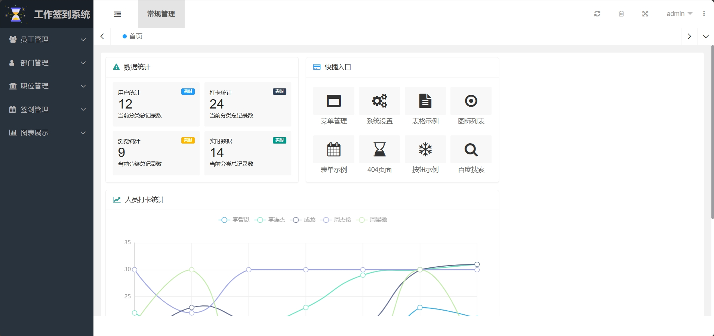
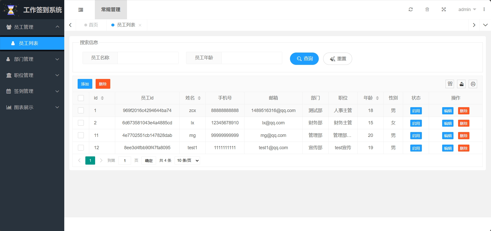
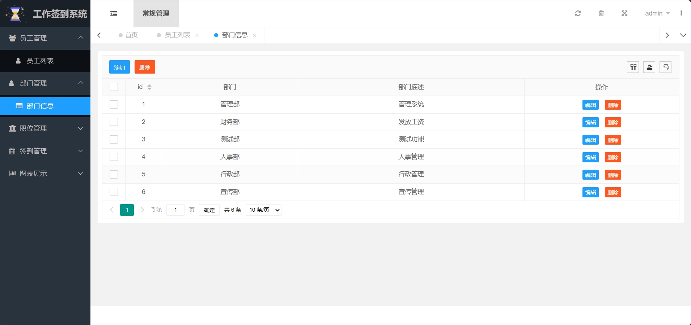
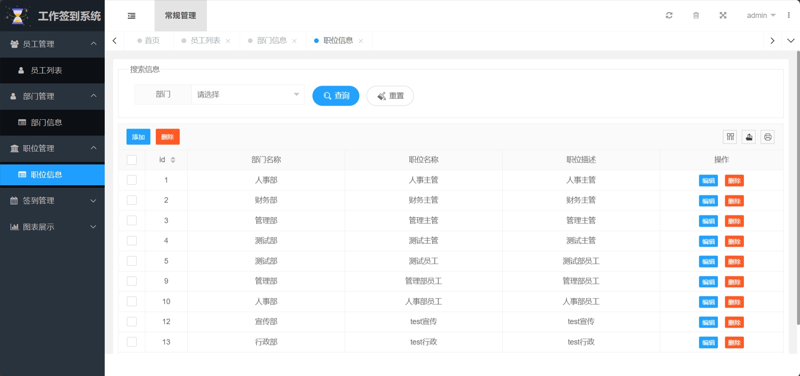
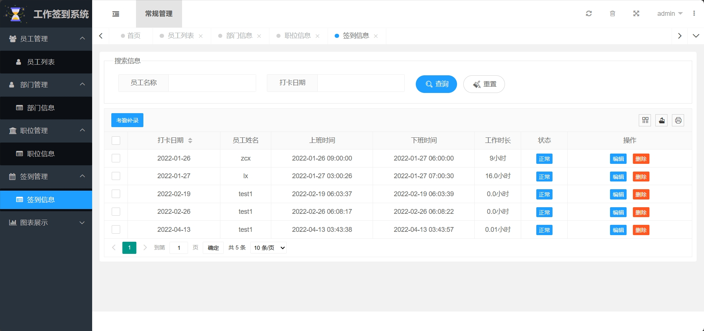
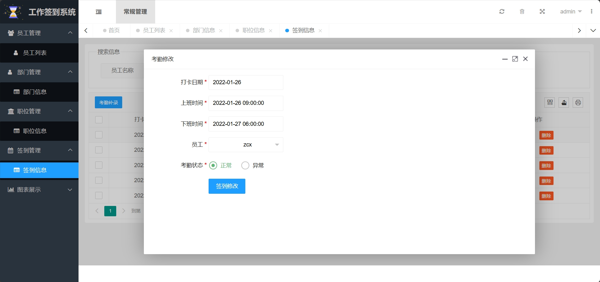
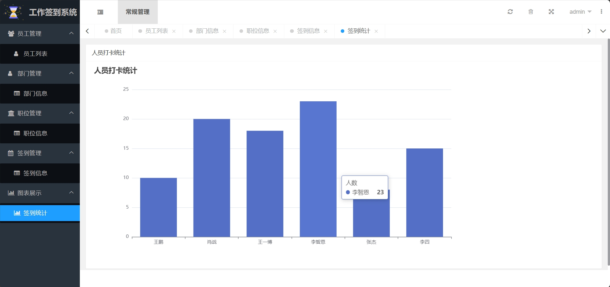

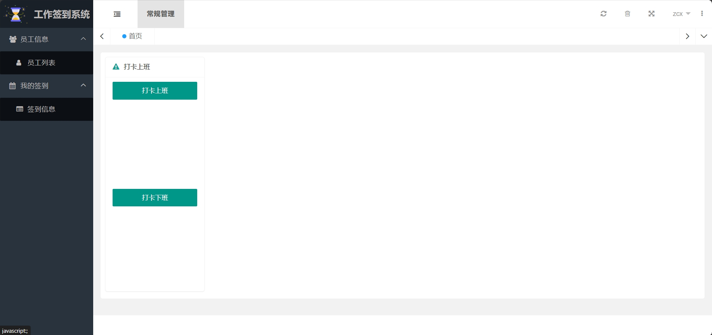
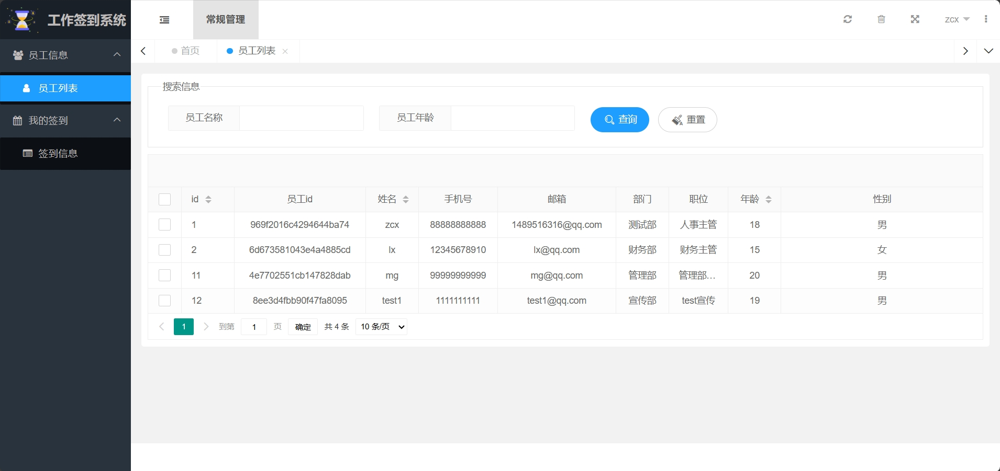
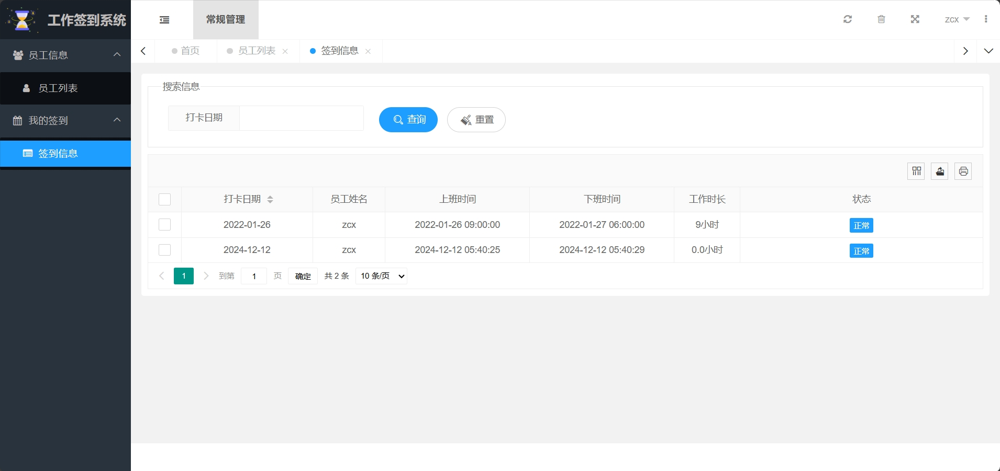
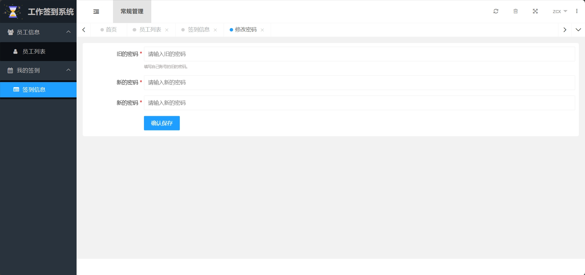

### 环境需求(可免费提供)
- idea/eclipse、jdk-1.8、maven-3.8.6、mysql、node.js等

## 有项目修改、安装调试需求 请联系微信

## 其他项目定制加微☝☝☝

